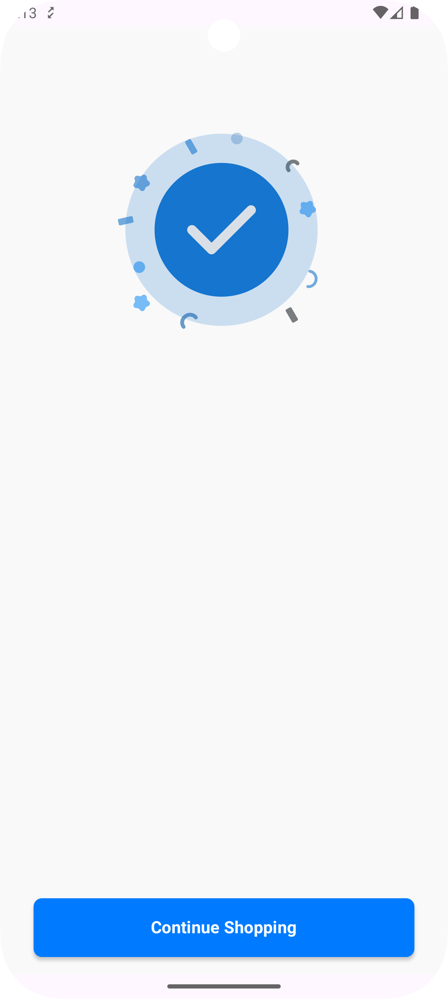

# Finish B2B E-commerce Compose 🛒


## Overview

This project is developed as part of my graduation thesis at Marmara University. It is a B2B (
Business to Business) e-commerce mobile application built with a modern Android stack using Jetpack
Compose. The goal is to design a system where businesses can efficiently manage orders, browse
catalogs, and interact through a clean and user-friendly interface.

While building this app, I focused on writing clean, modular, and maintainable code by applying
modern Android development principles and patterns. I believe in the value of well-structured
architecture, and this project reflects my passion for both development and good design.

---

Bu proje, Marmara Üniversitesi’ndeki bitirme tezimin bir parçası olarak geliştirilmiştir. B2B (
Business to Business) mantığıyla çalışan bir e-ticaret mobil uygulamasıdır. İşletmelerin siparişleri
yönetebileceği, katalogları görüntüleyebileceği ve kullanıcı dostu bir arayüzle etkileşimde
bulunabileceği bir sistem hedeflenmiştir.

Uygulamayı geliştirirken temiz, modüler ve sürdürülebilir bir kod yapısı oluşturmaya özen gösterdim.
Modern Android mimari prensiplerine sadık kalarak elimden gelenin en iyisini yapmaya çalıştım. Bu
proje, yazılım geliştirmeye ve güzel tasarımlı sistemlere olan ilgimi yansıtıyor.

## 🚀 Project Features

- **CLEAN ARCHITECTURE**
- **MVVM**
- **MVI**
- **COMPOSE**
- **PREVIEW PARAMETER PROVIDER**
- **Navigation + Bottom Navigation + Type Safety**
- **BOTTOM-NAVIGATION**
- **Hilt (Dependency Injection)**
- **Retrofit (Networking)**
- **DATA SOURCE**
- **Detekt (Static Code Analysis)**
- **Coil (Image Loading)**
- **VERSION CATALOG**
- **COROUTINES FLOW**

## 📸 Screenshots

<h2 style="text-align:center;">📸 Uygulama Ekran Görüntüleri</h2>

<table style="margin:auto;">
  <tr>
    <th>Welcome</th>
    <th>Login</th>
    <th>SignUp</th>
  </tr>
  <tr>
    <td></td>
    <td></td>
    <td></td>
  </tr>
</table>
<br/>
<table style="margin:auto;">
  <tr>
    <th>Home</th>
    <th>Product List</th>
    <th>Search</th>
  </tr>
  <tr>
    <td></td>
    <td></td>
    <td></td>
  </tr>
</table>
<br/>
<table style="margin:auto;">
  <tr>
    <th>Detail 1</th>
    <th>Detail 2</th>
    <th>Evaluation</th>
  </tr>
  <tr>
    <td></td>
    <td></td>
    <td></td>
  </tr>
</table>
<br/>
<table style="margin:auto;">
  <tr>
    <th>Cart</th>
    <th>Payment</th>
    <th>Payment 2</th>
  </tr>
  <tr>
    <td></td>
    <td></td>
    <td></td>
  </tr>
</table>
<br/>
<table style="margin:auto;">
  <tr>
    <th>Favorite</th>
    <th>Add Card ListBS</th>
  </tr>
  <tr>
    <td></td>
    <td></td>
  </tr>
</table>
<table style="margin:auto;">
  <tr>
    <th>Collection</th>
    <th>Create Collection</th>
    <th>Selected Favorite</th>
  </tr>
  <tr>
    <td></td>
    <td></td>
    <td></td>
  </tr>
</table>
<br/>
<table style="margin:auto;">
  <tr>
    <th>Address</th>
    <th>Order Success</th>
    <th>Profile</th>
  </tr>
  <tr>
    <td></td>
    <td></td>
    <td></td>
  </tr>
</table>
<br/>
<table style="margin:auto;">
  <tr>
    <th>Edit Profile</th>
    <th>Edit Profile 2</th>
    <th>Card List</th>
  </tr>
  <tr>
    <td></td>
    <td></td>
    <td></td>
  </tr>
</table>

## Package Structure

```
├── FinishMarmaraB2B.kt
├── core
│ ├── common
│ ├── data
│ ├── domain
│ └── presentation
├── di
│ ├── AnalyticsModule.kt
│ ├── ConnectivityModule.kt
│ ├── DataStoreModule.kt
│ ├── JsonModule.kt
│ ├── LocalDataSourceModule.kt
│ ├── NetworkModule.kt
│ └── RepositoryModule.kt
├── ecommerce
│ ├── data
│ └── domain
├── navigation
│ ├── NavigationGraph.kt
│ ├── Screen.kt
│ ├── SellerNavigationGraph.kt
│ ├── SerializableType.kt
│ └── bottom
├── structure_finishmarmarab2b.txt
└── ui
├── MainActivity.kt
├── MainContract.kt
├── MainViewModel.kt
├── address
├── cart
├── creditcard
├── detail
├── editprofile
├── evaluation
├── favorite
├── home
├── login
├── mock
├── orderlist
├── ordersuccess
├── password
├── payment
├── products
├── profile
├── search
├── selectedfavorite
├── seller
├── signup
├── splash
├── theme
└── welcome
```

## 🧑‍💻 How to Run

1. Clone the repository
   ```bash
   git clone https://github.com/kullaniciadi/FinishMarmaraB2B.git

## Code blocks

```kotlin
 fun main() {
    println("Welcome to FinishMarmaraB2B 🚀")
    println("Crafted with clean architecture & love 💙")
}
```

---

<p style="text-align:center">
  Made with ❤️ by <strong>Oguzhan</strong>
</p>
